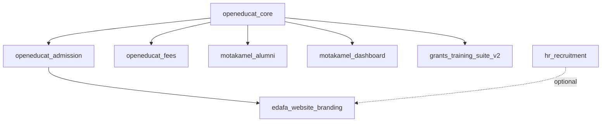

# ASTA Training 19 - OpenEduCat Customizations

Custom Odoo 19.0 educational management system with enhanced features for student admission, training management, and alumni relations.

---

## 🚀 Quick Start for Testers

**New to this project?** Start here:

1. **� Read the project summary**: [PROJECT_SUMMARY.md](PROJECT_SUMMARY.md) - High-level overview
2. **📖 Read the implementation overview** (below) for detailed descriptions
3. **🧪 Follow the testing guide**: [docs/2025-01-implementation/TESTING_GUIDE.md](docs/2025-01-implementation/TESTING_GUIDE.md)
4. **📋 Review implementation docs**: [docs/2025-01-implementation/](docs/2025-01-implementation/)

### Quick Deployment

```bash
# Update all modules
odoo-bin -u edafa_website_branding,openeducat_core,motakamel_alumni,motakamel_dashboard,openeducat_fees -d your_database --stop-after-init

# Restart Odoo
sudo systemctl restart odoo
```

---

## 📋 Overview

This repository contains customized Odoo modules for educational institutions, including:
- Enhanced admission workflows with profile selection
- Department-based program filtering
- Training suite with grant management
- Alumni management system
- Dashboard and branding customizations

## 🚀 Recent Implementations

**Total Implementations:** 10 | **All Completed:** January 3, 2026

### Quick Reference Table

| # | Implementation | Module(s) | Priority | Status |
|---|----------------|-----------|----------|--------|
| 1 | English Numerals CSS | 5 modules | Medium | ✅ |
| 2 | Profile Selection | edafa_website_branding | High | ✅ |
| 3 | Course Department Field | openeducat_core | Medium | ✅ |
| 4 | Department Programs | openeducat_core | High | ✅ |
| 5 | Admission Filtering | edafa_website_branding | High | ✅ |
| 6 | Active Programs Filter | edafa_website_branding | Medium | ✅ |
| 7 | Label Renaming | openeducat_core | Low | ✅ |
| 8 | Role Conversion Fix | openeducat_core | Critical | ✅ |
| 9 | Admission Routing | edafa_website_branding | High | ✅ |
| 10 | Login Signup Removal | edafa_website_branding | Medium | ✅ |

---

### Detailed Implementation Descriptions

### 1. English Numerals Enforcement (CSS)
**Status:** ✅ Completed

Forces all numbers across the website to display using English numerals (0-9) regardless of browser locale or system language settings.

**Modules Updated:**
- `edafa_website_branding`
- `motakamel_alumni`
- `motakamel_dashboard`
- `openeducat_core`
- `openeducat_fees`

**Implementation:**
- Created `static/src/css/english_numerals.css` in each module
- Applied comprehensive CSS rules targeting all numeric displays
- Added to module manifests with proper asset bundling

**Documentation:** See implementation files in each module's `static/src/css/` directory

---

### 2. Profile Selection in Admission Flow
**Status:** ✅ Completed

Added user profile type selection (Student vs Trainer) at the start of the admission process with intelligent routing.

**Features:**
- Profile selection page with card-based UI
- Student route → Admission wizard
- Trainer route → Job recruitment (if hr_recruitment installed) or Contact Us
- Conditional module detection for hr_recruitment

**Files Modified:**
- `edafa_website_branding/controllers/admission_portal.py`
- `edafa_website_branding/views/profile_selection_template.xml`
- `edafa_website_branding/views/trainer_recruitment_template.xml`
- `edafa_website_branding/__manifest__.py`

**Routes:**
- `/admission/apply` - Profile selection
- `/admission/apply/student` - Student admission wizard
- `/admission/apply/trainer` - Trainer information/redirect

**Documentation:** [docs/2025-01-implementation/PROFILE_SELECTION_FEATURE.md](docs/2025-01-implementation/PROFILE_SELECTION_FEATURE.md)

---

### 3. Department Field on Course Creation
**Status:** ✅ Completed

Made the Department field visible and accessible on the Course Creation page by removing security group restrictions.

**Changes:**
- Removed `groups="openeducat_core.group_multi_department"` from department_id field
- Now visible in list, form, and search views for all users

**Files Modified:**
- `openeducat_core/views/course_view.xml`

**Documentation:** [docs/2025-01-implementation/COURSE_DEPARTMENT_FIELD.md](docs/2025-01-implementation/COURSE_DEPARTMENT_FIELD.md)

---

### 4. Programs Field on Department Page
**Status:** ✅ Completed

Added Many2many relationship to link programs with departments, allowing departments to define which programs they offer.

**Features:**
- Many2many field: `program_ids` on `op.department`
- Programs tab in department form view
- Programs column in department list view
- Programs filter in search view

**Files Modified:**
- `openeducat_core/models/department.py`
- `openeducat_core/views/department_view.xml`

**Documentation:** [docs/2025-01-implementation/DEPARTMENT_PROGRAMS_FIELD.md](docs/2025-01-implementation/DEPARTMENT_PROGRAMS_FIELD.md)

---

### 5. Department-Based Admission Filtering
**Status:** ✅ Completed

Made Department selection mandatory as the first step in admission, with cascading filters for Programs and Courses.

**Features:**
- Department field required on admission form
- Programs filtered by selected department
- Courses filtered by selected department and program
- Dynamic JavaScript-based filtering in portal wizard
- Backend validation in controller

**Workflow:**
1. Select Department (required, first field)
2. Select Program (filtered by department)
3. Select Course (filtered by department and program)

**Files Modified:**
- `edafa_website_branding/models/admission_extended.py`
- `edafa_website_branding/controllers/admission_portal.py`
- `edafa_website_branding/views/admission_wizard_templates.xml`

**Documentation:** [docs/2025-01-implementation/ADMISSION_DEPARTMENT_FILTERING.md](docs/2025-01-implementation/ADMISSION_DEPARTMENT_FILTERING.md)

---

### 6. Active Programs Filter
**Status:** ✅ Completed

Programs now only appear during registration if they contain available and active courses.

**Implementation:**
- Controller filters programs based on active course availability
- Uses `courses.mapped('program_id')` to identify programs with active courses
- Ensures users only see programs they can actually register for

**Files Modified:**
- `edafa_website_branding/controllers/admission_portal.py`

---

### 7. Label Renaming: Parent → Main
**Status:** ✅ Completed

Renamed user-facing labels for better clarity:
- "Parent Course" → "Main Courses"
- "Parent Department" → "Main Department"

**Locations Updated:**
- Course list view
- Course form view
- Course search view
- Course filter
- Department list view
- Department form view
- Department search view

**Files Modified:**
- `openeducat_core/views/course_view.xml` (4 replacements)
- `openeducat_core/views/department_view.xml` (3 replacements)

**Note:** Only display labels changed; field names and functionality remain unchanged.

---

### 8. User Role Conversion Fix (Odoo 19)
**Status:** ✅ Completed

Fixed the issue where converting a user from "user" role to "portal" role doesn't apply correctly in Odoo 19.

**Problem:**
In Odoo 19, the `groups_id` field on `res.users` is read-only, causing role conversions to fail silently.

**Solution:**
Custom `write()` override that:
- Intercepts `groups_id` write operations
- Applies changes using inverse relationship (`res.groups.users`)
- Supports all Many2many command formats
- Includes error handling and logging

**Files Created:**
- `openeducat_core/models/res_users_extended.py` - Main fix
- `openeducat_core/USER_ROLE_CONVERSION_FIX.md` - Full documentation
- `openeducat_core/ROLE_CONVERSION_IMPLEMENTATION.md` - Technical details
- `openeducat_core/QUICK_FIX_GUIDE.md` - Quick reference
- `openeducat_core/test_role_conversion.py` - Test script

**Files Modified:**
- `openeducat_core/models/__init__.py` - Added import

**Documentation:** See `openeducat_core/QUICK_FIX_GUIDE.md` for deployment steps

---

### 9. Admission Register Routing Fix
**Status:** ✅ Completed

Fixed the issue where multiple open admissions (e.g., different entities/governorates) were all being routed to only one admission register.

**Problem:**
All admission applications were being assigned to the first matching register, regardless of the course or program selected.

**Solution:**
Implemented intelligent routing hierarchy:
1. **Course Match (Most Specific):** Find register matching the selected course
2. **Program Match (Fallback):** If no course match, find register matching the program
3. **Any Available (Last Resort):** If no course/program match, use any available register
4. **Create Default (Safety):** If still no match, create a default register

**Files Modified:**
- `edafa_website_branding/controllers/admission_portal.py` (lines ~217-255)

**Documentation:** [docs/2025-01-implementation/ADMISSION_ROUTING_FIX.md](docs/2025-01-implementation/ADMISSION_ROUTING_FIX.md)

---

### 10. Login Page Signup Section Removal
**Status:** ✅ Completed

Removed the "Don't have an account?" section/field from the registration/login page to prevent public self-registration.

**Implementation:**
- Template inheritance of `web.login`
- XPath-based element hiding using CSS `display: none`
- Alternative method (replace) available but inactive
- Non-invasive, reversible approach

**Files Created:**
- `edafa_website_branding/views/auth_signup_login.xml` - Template inheritance

**Files Modified:**
- `edafa_website_branding/__manifest__.py` - Added template to data list

**Impact:**
- Users can no longer self-register from login page
- Admins must manually create users or grant portal access
- Cleaner, more professional login interface

**Documentation:** See `edafa_website_branding/LOGIN_SIGNUP_REMOVAL.md` for full details

---

## 📁 Module Structure

```
custo/
├── edafa_website_branding/          # Website branding and admission portal
│   ├── controllers/
│   │   └── admission_portal.py      # Admission routes and logic
│   ├── models/
│   │   └── admission_extended.py    # Department filtering
│   ├── static/src/css/
│   │   └── english_numerals.css     # Number display fix
│   ├── views/
│   │   ├── profile_selection_template.xml
│   │   ├── trainer_recruitment_template.xml
│   │   └── admission_wizard_templates.xml
│   └── __manifest__.py
│
├── grants_training_suite_v2/        # Training and grants management
│   └── [training suite modules]
│
├── motakamel_alumni/                # Alumni management system
│   ├── static/src/css/
│   │   └── english_numerals.css
│   └── [alumni modules]
│
├── motakamel_dashboard/             # Custom dashboard
│   ├── static/src/css/
│   │   └── english_numerals.css
│   └── [dashboard modules]
│
└── openeducat_*/                    # OpenEduCat core modules
    ├── openeducat_core/
    │   ├── models/
    │   │   ├── department.py        # Programs field
    │   │   ├── res_users_extended.py # Role conversion fix
    │   │   └── [other models]
    │   ├── static/src/css/
    │   │   └── english_numerals.css
    │   ├── views/
    │   │   ├── course_view.xml      # Department visibility
    │   │   └── department_view.xml  # Programs field
    │   ├── COURSE_DEPARTMENT_FIELD.md
    │   ├── DEPARTMENT_PROGRAMS_FIELD.md
    │   ├── USER_ROLE_CONVERSION_FIX.md
    │   ├── ROLE_CONVERSION_IMPLEMENTATION.md
    │   ├── QUICK_FIX_GUIDE.md
    │   └── test_role_conversion.py
    │
    ├── openeducat_admission/
    ├── openeducat_fees/
    │   ├── static/src/css/
    │   │   └── english_numerals.css
    │   └── [fee modules]
    └── [other openeducat modules]
```

## 🔧 Installation & Deployment

### Prerequisites

- Odoo 19.0
- Python 3.10+
- PostgreSQL 13+
- Required Odoo modules:
  - base
  - portal
  - website
  - hr_recruitment (optional, for trainer routing)

### Installation Steps

1. **Clone the repository:**
   ```bash
   git clone <repository-url>
   cd asta_training_19
   ```

2. **Update Odoo configuration:**
   ```ini
   [options]
   addons_path = /path/to/odoo/addons,/path/to/asta_training_19/custo
   ```

3. **Install modules:**
   ```bash
   # Via Odoo CLI
   odoo-bin -c /etc/odoo.conf -d your_database -i edafa_website_branding,openeducat_core,motakamel_alumni,motakamel_dashboard,grants_training_suite_v2
   
   # Or via Web UI
   # Apps → Remove Filters → Search → Install
   ```

4. **Apply recent updates:**
   ```bash
   # Restart Odoo
   sudo systemctl restart odoo
   
   # Upgrade modules
   odoo-bin -c /etc/odoo.conf -d your_database -u edafa_website_branding,openeducat_core --stop-after-init
   ```

### Post-Installation Configuration

1. **Configure Departments:**
   - Navigate to Education → Configuration → Departments
   - Link programs to each department using the Programs tab

2. **Test Admission Flow:**
   - Visit `/admission/apply`
   - Select profile type (Student/Trainer)
   - Complete the admission process

3. **Verify User Role Conversion:**
   - Settings → Users & Companies → Users
   - Test converting user ↔ portal roles

## 🧪 Testing

### English Numerals Test
- Navigate to any page with numbers
- Verify all digits display as 0-9 (not localized)
- Test in different browser locales (Arabic, French, etc.)

### Profile Selection Test
```
1. Go to /admission/apply
2. Click "Student" → Should redirect to admission wizard
3. Go back to /admission/apply
4. Click "Trainer" → Should redirect based on hr_recruitment availability
```

### Department Filtering Test
```
1. Start admission process as student
2. Select a department
3. Verify only programs from that department appear
4. Select a program
5. Verify only courses from that department and program appear
```

### Role Conversion Test
```bash
# Using test script
odoo-bin shell -c /etc/odoo.conf -d your_database

# In shell:
exec(open('/workspaces/asta_training_19/custo/openeducat_core/test_role_conversion.py').read())
test_user_role_conversion(env, USER_ID)
```

## 📊 Module Dependencies



## 🔐 Security & Access Control

### User Groups

| Group | Description | Access Level |
|-------|-------------|--------------|
| `base.group_portal` | Portal Users | Portal only |
| `base.group_user` | Internal Users | Backend access |
| `openeducat_core.group_op_back_office` | Education User | Education features |
| `openeducat_core.group_op_back_office_admin` | Education Manager | Full education access |

### Access Rights

- **Students:** Portal access, view own records
- **Faculty:** Backend access, manage assigned students
- **Staff:** Education user, manage operations
- **Administrators:** Full system access

## 📝 Development Guidelines

### Adding New Features

1. Create feature branch: `git checkout -b feature/description`
2. Implement changes in appropriate module
3. Update module `__manifest__.py` if adding files
4. Create documentation in module directory
5. Test thoroughly
6. Update this README if applicable
7. Commit with clear messages
8. Create pull request

### Code Standards

- Follow Odoo coding guidelines
- Use proper inheritance (`_inherit` vs `_name`)
- Include docstrings for classes and methods
- Add XML view IDs with module prefix
- Use translation markers for user-facing strings
- Include error handling and logging

### Documentation Standards

- Create MD files for major features
- Include implementation details
- Add testing procedures
- Provide troubleshooting steps
- Update main README

## 🐛 Troubleshooting

### Common Issues

**Issue: English numerals not displaying**
- Clear browser cache
- Verify CSS files loaded (inspect element → Network tab)
- Check module manifest includes CSS in assets

**Issue: Profile selection page not showing**
- Verify route `/admission/apply` is accessible
- Check template exists in views
- Ensure module upgraded after adding templates

**Issue: Department filtering not working**
- Check JavaScript console for errors
- Verify data attributes on select elements
- Test with browser dev tools enabled

**Issue: User role conversion fails**
- See `openeducat_core/QUICK_FIX_GUIDE.md`
- Check Odoo logs for errors
- Verify module upgraded successfully
- Run test script to diagnose

**Issue: Programs not showing in admission**
- Verify programs have active courses
- Check department-program relationship configured
- Review controller logic for filtering

### Debug Mode

Enable debug mode for detailed error messages:
```
http://your-domain.com?debug=1
```

### Logs

Check Odoo logs:
```bash
tail -f /var/log/odoo/odoo-server.log
```

## 📚 Documentation Index

### Implementation Documentation

All implementation documentation has been organized in the timestamped folder:

**📁 [docs/2025-01-implementation/](docs/2025-01-implementation/)**

This folder contains:
- **[README.md](docs/2025-01-implementation/README.md)** - Implementation overview and index
- **[TESTING_GUIDE.md](docs/2025-01-implementation/TESTING_GUIDE.md)** - Comprehensive testing procedures for all implementations

#### Individual Implementation Docs (in docs/2025-01-implementation/)

1. [ENGLISH_NUMERALS_IMPLEMENTATION.md](docs/2025-01-implementation/ENGLISH_NUMERALS_IMPLEMENTATION.md) - CSS enforcement for English numerals
2. [PROFILE_SELECTION_FEATURE.md](docs/2025-01-implementation/PROFILE_SELECTION_FEATURE.md) - Profile type selection (Student/Trainer)
3. [COURSE_DEPARTMENT_FIELD.md](docs/2025-01-implementation/COURSE_DEPARTMENT_FIELD.md) - Department field visibility on Course page
4. [DEPARTMENT_PROGRAMS_FIELD.md](docs/2025-01-implementation/DEPARTMENT_PROGRAMS_FIELD.md) - Programs field on Department page
5. [ADMISSION_DEPARTMENT_FILTERING.md](docs/2025-01-implementation/ADMISSION_DEPARTMENT_FILTERING.md) - Department-based admission filtering + Active programs filter
6. [ROLE_CONVERSION_FIX_ODOO19.md](docs/2025-01-implementation/ROLE_CONVERSION_FIX_ODOO19.md) - User role conversion fix for Odoo 19
7. [ADMISSION_ROUTING_FIX.md](docs/2025-01-implementation/ADMISSION_ROUTING_FIX.md) - Multiple admission registers routing fix
8. [LOGIN_SIGNUP_REMOVAL_SUMMARY.md](docs/2025-01-implementation/LOGIN_SIGNUP_REMOVAL_SUMMARY.md) - Remove signup section from login page

### Module-Specific Documentation

- **openeducat_core/**: Additional technical docs for role conversion
  - `USER_ROLE_CONVERSION_FIX.md` - Full documentation
  - `ROLE_CONVERSION_IMPLEMENTATION.md` - Technical details
  - `QUICK_FIX_GUIDE.md` - Quick reference
  - `test_role_conversion.py` - Test script

- **edafa_website_branding/**: Feature-specific guides
  - `LOGIN_SIGNUP_REMOVAL.md` - Detailed login page modification guide

### For Testers

**🧪 Start Here:** [docs/2025-01-implementation/TESTING_GUIDE.md](docs/2025-01-implementation/TESTING_GUIDE.md)

This comprehensive guide includes:
- Pre-testing setup instructions
- Step-by-step test procedures for all 10 implementations
- Expected results and failure scenarios
- Troubleshooting common issues
- Test result documentation template

## 🔄 Update History

| Date | Version | Description |
|------|---------|-------------|
| 2025-01 | 1.10.0 | Login page signup section removal |
| 2025-01 | 1.9.0 | Admission register routing fix |
| 2025-01 | 1.8.0 | User role conversion fix for Odoo 19 |
| 2025-01 | 1.7.0 | Label renaming (Parent → Main) |
| 2025-01 | 1.6.0 | Active programs filter |
| 2025-01 | 1.5.0 | Department-based admission filtering |
| 2025-01 | 1.4.0 | Programs field on Department page |
| 2025-01 | 1.3.0 | Department field visible on Course page |
| 2025-01 | 1.2.0 | Profile selection in admission flow |
| 2025-01 | 1.1.0 | English numerals CSS enforcement |
| 2024-12 | 1.0.0 | Initial project setup |

## 👥 Contributors

- Development Team
- QA Team
- Educational Institution Staff

## 📄 License

See individual module licenses. Most modules based on OpenEduCat use LGPL-3.

## 🆘 Support

For issues or questions:
1. Check documentation in relevant module directory
2. Review troubleshooting section above
3. Check Odoo logs for detailed error messages
4. Contact development team

## 🚧 Future Enhancements

- [ ] Enhanced reporting dashboard
- [ ] Mobile app integration
- [ ] Advanced analytics for admission trends
- [ ] Automated email notifications
- [ ] Payment gateway integration
- [ ] Document management system
- [ ] Multi-language support expansion

---

**Project:** ASTA Training 19  
**Odoo Version:** 19.0  
**Status:** ✅ Production Ready  
**Last Updated:** January 2025
